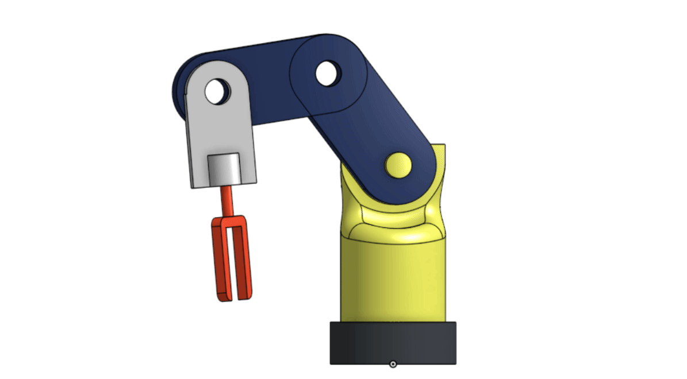

# 5-DOF Robotic Arm Design using Onshape

## What is meant by “Degrees of Freedom (DOF)”?

**Degree of Freedom (DOF)** refers to the number of independent movements the robotic arm can perform.  
Each joint in the arm provides a specific type of motion, such as:
- **Rotation** – the ability to rotate around an axis  
- **Bending** – the ability to bend up or down
