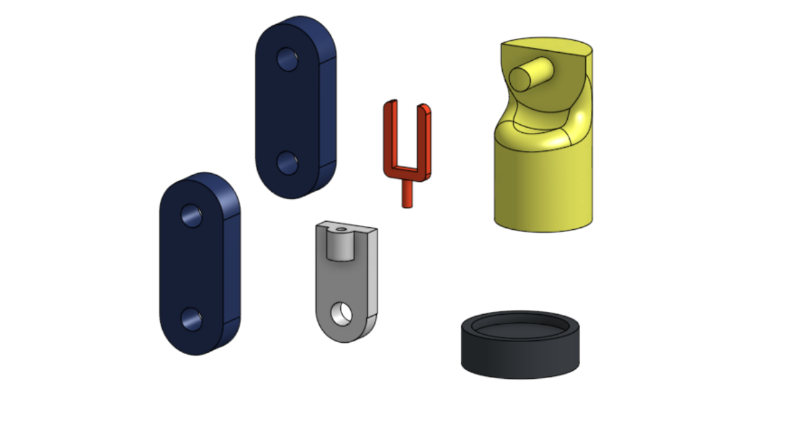

# 5-DOF Robotic Arm Design using Onshape

##  What is meant by “Degrees of Freedom (DOF)”?
**Degree of Freedom (DOF)** refers to the number of independent movements a robotic arm can perform.  
The image below shows different types of motion involved in a 5-DOF robotic arm:

These include:
- **Revolve** – base rotation  
- **Forward and Backward** – linear segment motion  
- **Bend** – elbow-like joint movement  
- **Rotate** – twisting along the arm’s axis  
- **Swivel / Up and Down** – wrist-like adjustments

###  Joint Mechanisms
These motions are made possible using two main joint types:
- **Revolute Joint** – enables rotation around an axis  
- **Prismatic Joint** – enables linear sliding along an axis

## About Onshape

[Onshape](https://www.onshape.com/) is a 3D design (CAD) software that works directly in your browser.  
There’s also a downloadable version for desktop and mobile.

Why use it?
- Easy to learn for beginners  
- Free for students and hobby projects  
- No installation needed (works online)  
- Supports team collaboration

###  Recommended Tutorial Channels
**[Onshape Official Playlists](https://www.youtube.com/@OnshapeInc/playlists)** – official tutorials from Onshape, great for learning tools, features, and workflows step by step.

##  Arm Components

The robotic arm is made up of 6 main parts. The image below shows them separated for clarity:

| Part # | Name               | Description                                      | Movement Type         |
|--------|--------------------|--------------------------------------------------|------------------------|
| 1️⃣     | Base (black)        | Fixed or rotating base that holds the arm       | Fixed / Revolve        |
| 2️⃣     | Lower Body (yellow) | Allows vertical movement of the arm             | Revolute Joint         |
| 3️⃣     | First Arm (blue)   | Connects lower body to upper arm                | Revolute Joint         |
| 4️⃣     | Second Arm (blue)  | Extends reach; connects to the wrist            | Revolute Joint         |
| 5️⃣     | Wrist Mount (gray) | Connects to gripper; may rotate or tilt         | Revolute / Fixed       |
| 6️⃣     | Gripper (red)      | End-effector to grip objects                    | Optional (Gripper)     |
